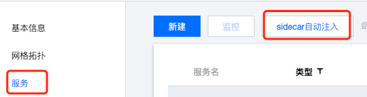

# istio 流量镜像 demo

## 下载代码仓库

克隆代码仓库:

```bash
git clone https://github.com/Tencent-Cloud-Mesh/mirroring-demo.git && cd mirroring-demo
```

## 开启 Sidecar 自动注入

在网格中开启 sidecar 自动注入:



可以选 default 命名空间。

## 安装 demo 应用

确保本地 kubeconfig 配置正常，可以用 kubectl 操作集群，然后执行下面命令将 demo 应用安装到集群中:

```bash
make install
```

会安装 httpbin 服务作为服务端，sleep 作为客户端，httpbin 有 v1 和 v2 两个版本，VirtualService 配置成了流量只转发到 v1 版本。

开两个终端可以验证，在第一个终端执行 `make curl` 让 sleep 应用对 httpbin 服务一直发起请求，然后再另一个终端执行 `make log` 查看 httpbin pod 的日志:

```bash
$ make log
kubectl logs -l app=httpbin --prefix=true --tail 1 -f
[pod/httpbin-v2-fb86d8d46-fwwdl/httpbin] [2022-10-21 09:27:45 +0000] [9] [INFO] Booting worker with pid: 9
[pod/httpbin-v1-75d9447d79-2hnzz/httpbin] [2022-10-21 09:27:57 +0000] [9] [INFO] Booting worker with pid: 9
[pod/httpbin-v1-75d9447d79-2hnzz/httpbin] 127.0.0.6 - - [21/Oct/2022:09:40:25 +0000] "GET /headers HTTP/1.1" 200 314 "-" "curl/7.85.0-DEV"
[pod/httpbin-v1-75d9447d79-2hnzz/httpbin] 127.0.0.6 - - [21/Oct/2022:09:40:26 +0000] "GET /headers HTTP/1.1" 200 314 "-" "curl/7.85.0-DEV"
[pod/httpbin-v1-75d9447d79-2hnzz/httpbin] 127.0.0.6 - - [21/Oct/2022:09:40:27 +0000] "GET /headers HTTP/1.1" 200 314 "-" "curl/7.85.0-DEV"
[pod/httpbin-v1-75d9447d79-2hnzz/httpbin] 127.0.0.6 - - [21/Oct/2022:09:40:28 +0000] "GET /headers HTTP/1.1" 200 314 "-" "curl/7.85.0-DEV"
[pod/httpbin-v1-75d9447d79-2hnzz/httpbin] 127.0.0.6 - - [21/Oct/2022:09:40:29 +0000] "GET /headers HTTP/1.1" 200 314 "-" "curl/7.85.0-DEV"
[pod/httpbin-v1-75d9447d79-2hnzz/httpbin] 127.0.0.6 - - [21/Oct/2022:09:40:30 +0000] "GET /headers HTTP/1.1" 200 314 "-" "curl/7.85.0-DEV"
[pod/httpbin-v1-75d9447d79-2hnzz/httpbin] 127.0.0.6 - - [21/Oct/2022:09:40:31 +0000] "GET /headers HTTP/1.1" 200 314 "-" "curl/7.85.0-DEV"
```

可以看到只有 v1 版本的 httpbin 服务收到了请求。

## 添加流量镜像规则

执行以下命令将 v1 版本服务收到的流量镜像给 v2 版本:

```bash
make mirror
```

对应的 VirtualService 如下:

```yaml
apiVersion: networking.istio.io/v1alpha3
kind: VirtualService
metadata:
  name: httpbin
spec:
  hosts:
    - httpbin
  http:
    - route:
        - destination:
            host: httpbin
            subset: v1
          weight: 100
      mirror:
        host: httpbin
        subset: v2
      mirrorPercentage:
        value: 100.0
```

再次使用前面的 `make curl` 和 `make log` 进行验证。可以看到每次 v1 收到的请求，v2 也收到了。

```txt
[pod/httpbin-v1-75d9447d79-2hnzz/httpbin] 127.0.0.6 - - [21/Oct/2022:09:40:42 +0000] "GET /headers HTTP/1.1" 200 314 "-" "curl/7.85.0-DEV"
[pod/httpbin-v1-75d9447d79-2hnzz/httpbin] 127.0.0.6 - - [21/Oct/2022:09:40:43 +0000] "GET /headers HTTP/1.1" 200 314 "-" "curl/7.85.0-DEV"
[pod/httpbin-v2-fb86d8d46-fwwdl/httpbin] 127.0.0.6 - - [21/Oct/2022:09:40:43 +0000] "GET /headers HTTP/1.1" 200 354 "-" "curl/7.85.0-DEV"
[pod/httpbin-v2-fb86d8d46-fwwdl/httpbin] 127.0.0.6 - - [21/Oct/2022:09:40:44 +0000] "GET /headers HTTP/1.1" 200 354 "-" "curl/7.85.0-DEV"
[pod/httpbin-v1-75d9447d79-2hnzz/httpbin] 127.0.0.6 - - [21/Oct/2022:09:40:44 +0000] "GET /headers HTTP/1.1" 200 314 "-" "curl/7.85.0-DEV"
[pod/httpbin-v2-fb86d8d46-fwwdl/httpbin] 127.0.0.6 - - [21/Oct/2022:09:40:45 +0000] "GET /headers HTTP/1.1" 200 354 "-" "curl/7.85.0-DEV"
[pod/httpbin-v1-75d9447d79-2hnzz/httpbin] 127.0.0.6 - - [21/Oct/2022:09:40:45 +0000] "GET /headers HTTP/1.1" 200 314 "-" "curl/7.85.0-DEV"
[pod/httpbin-v1-75d9447d79-2hnzz/httpbin] 127.0.0.6 - - [21/Oct/2022:09:40:46 +0000] "GET /headers HTTP/1.1" 200 314 "-" "curl/7.85.0-DEV"
[pod/httpbin-v2-fb86d8d46-fwwdl/httpbin] 127.0.0.6 - - [21/Oct/2022:09:40:46 +0000] "GET /headers HTTP/1.1" 200 354 "-" "curl/7.85.0-DEV"
[pod/httpbin-v2-fb86d8d46-fwwdl/httpbin] 127.0.0.6 - - [21/Oct/2022:09:40:47 +0000] "GET /headers HTTP/1.1" 200 354 "-" "curl/7.85.0-DEV"
```